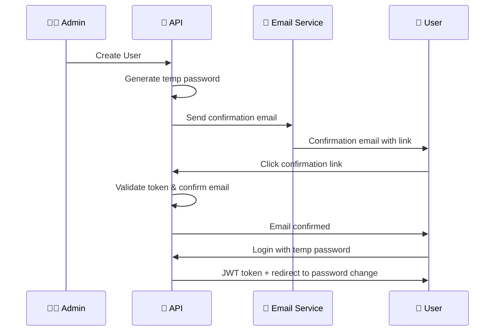
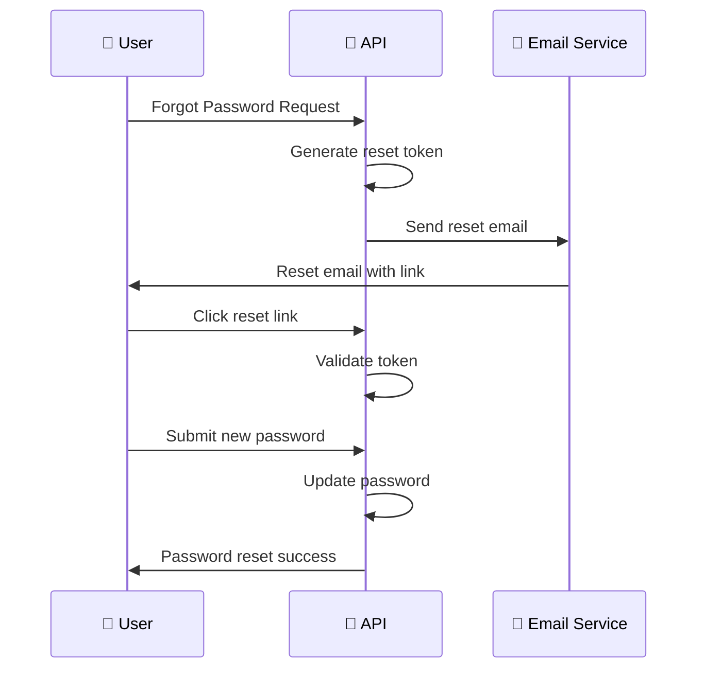
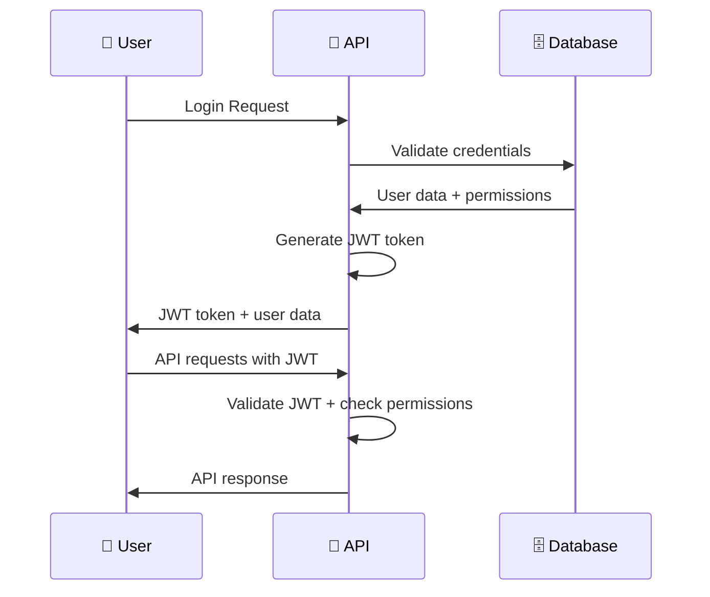

# 🔐 Complete Authentication System Documentation

This document provides comprehensive documentation for the complete authentication system included in this template.

## 📋 Table of Contents

- [Overview](#overview)
- [Authentication Flows](#authentication-flows)
- [API Endpoints](#api-endpoints)
- [Frontend Implementation](#frontend-implementation)
- [Security Features](#security-features)
- [Email Templates](#email-templates)
- [Testing](#testing)
- [Deployment](#deployment)

## 🎯 Overview

The authentication system provides a complete, enterprise-grade solution with the following features:

### ✅ Complete Feature Set

1. **User Login** - JWT token-based authentication
2. **User Logout** - Secure logout with audit logging
3. **Token Refresh** - Automatic token refresh with rate limiting
4. **Forgot Password** - Email-based password reset request
5. **Reset Password** - Secure token-based password reset
6. **Email Confirmation** - Required email verification for new users
7. **User Creation** - Admin-created users with email confirmation

### 🛡️ Security Features

- **ASP.NET Core Identity** - Enterprise-grade user management
- **JWT Token Authentication** - Secure token-based auth
- **Account Lockout** - Automatic (5 failed attempts → 15-min) or Admin-initiated (`LockoutEnabled = true`)
- **Rate Limiting** - 10 requests per 15 minutes on refresh
- **Audit Logging** - Complete security event tracking
- **Password Complexity** - 8+ chars, uppercase, lowercase, number
- **Email Security** - Professional templates with secure links

## 🔄 Authentication Flows

### 1. User Registration Flow



### 2. Password Reset Flow



### 3. Login Flow



## 📡 API Endpoints

### Authentication Endpoints

#### POST /api/auth/login

**Purpose**: Authenticate user and return JWT token

**Request**:

```json
{
  "email": "user@example.com",
  "password": "password123"
}
```

**Response**:

```json
{
  "success": true,
  "data": {
    "user": {
      "id": "guid",
      "email": "user@example.com",
      "firstName": "John",
      "lastName": "Doe",
      "userStatus": "Active",
      "role": { "name": "Admin" },
      "permissions": ["users:view", "users:create"],
      "permissionKeys": ["users:view", "users:create"]
    },
    "token": "jwt-token-string",
    "expiresAt": "2024-01-01T12:00:00Z"
  }
}
```

#### POST /api/auth/logout

**Purpose**: Logout user (client discards JWT)

**Headers**: `Authorization: Bearer <token>`

**Response**:

```json
{
  "success": true,
  "data": true
}
```

#### POST /api/auth/refresh-token

**Purpose**: Refresh JWT token (rate limited)

**Headers**: `Authorization: Bearer <token>`

**Response**:

```json
{
  "success": true,
  "data": {
    "user": {
      /* user data */
    },
    "token": "new-jwt-token",
    "expiresAt": "2024-01-01T20:00:00Z"
  }
}
```

#### POST /api/auth/forgot-password

**Purpose**: Send password reset email

**Request**:

```json
{
  "email": "user@example.com"
}
```

**Response**:

```json
{
  "success": true,
  "data": true
}
```

#### POST /api/auth/reset-password

**Purpose**: Reset password using token from email

**Request**:

```json
{
  "email": "user@example.com",
  "token": "reset-token-from-email",
  "newPassword": "newpassword123"
}
```

**Response**:

```json
{
  "success": true,
  "data": true
}
```

#### POST /api/auth/confirm-email

**Purpose**: Confirm email address using token and set password

**Request**:

```json
{
  "email": "user@example.com",
  "token": "confirmation-token-from-email",
  "password": "newpassword123"
}
```

**Response**:

```json
{
  "success": true,
  "data": true
}
```

## 🎨 Frontend Implementation

### Pages and Components

#### LoginPage.tsx

- **Purpose**: User login form
- **Features**:
  - Form validation with Zod schemas
  - Password visibility toggle
  - Remember me functionality
  - Loading states and error handling
  - Automatic redirect on success

#### ForgotPasswordPage.tsx

- **Purpose**: Password reset request form
- **Features**:
  - Email validation
  - Success/error message handling
  - Automatic redirect to login after success

#### ResetPasswordPage.tsx

- **Purpose**: Password reset form with token validation
- **Features**:
  - URL parameter extraction (email and token)
  - Password visibility toggles
  - Password confirmation validation
  - Professional UI with error handling

#### ConfirmEmailPage.tsx

- **Purpose**: Email confirmation and password setup form
- **Features**:
  - URL parameter extraction (email and token)
  - Password input and validation
  - Success confirmation screen
  - Professional UI with error handling

### State Management

#### Redux Store

- **authSlice.ts**: Authentication state management
- **Actions**: loginUser, logoutUser, refreshToken, forgotPassword
- **State**: user, token, isAuthenticated, isLoading, error

#### Services

- **authService.ts**: API communication
- **Methods**: login, logout, refreshToken, forgotPassword, resetPassword, confirmEmail (with password)
- **Features**: Automatic token refresh, error handling, mock data support

### Form Validation

#### Zod Schemas

- **loginSchema**: Email and password validation
- **forgotPasswordSchema**: Email validation
- **resetPasswordSchema**: Email, token, and password validation
- **confirmEmailSchema**: Email, token, and password validation

## 🛡️ Security Features

### Backend Security

#### ASP.NET Core Identity

- **UserManager**: User management operations
- **SignInManager**: Sign-in/sign-out operations
- **RoleManager**: Role management operations
- **Password Hashing**: Secure password storage
- **Account Lockout**: Brute force protection + admin-initiated lockout

#### Account Lockout System

**Two Types of Lockout**:

1. **Automatic Lockout** (Brute Force Protection):
   - Triggered after 5 failed login attempts
   - Automatically unlocks after 15 minutes
   - `LockoutEnd` is set to 15 minutes in the future

2. **Admin-Initiated Lockout** (Manual Lock):
   - Set `LockoutEnabled = true` to lock a user immediately
   - If `LockoutEnd` is null → user is locked permanently
   - If `LockoutEnd` is set to future date → user is locked until that date

**What Happens When a User is Locked**:
- ❌ Cannot log in (returns "Account locked" error)
- ❌ Cannot access any API endpoints (returns 401 Unauthorized)
- ❌ Cannot refresh their token
- ❌ Existing JWT tokens are rejected on every request

**Lockout Check Logic**:
```csharp
bool isLockedOut = user.LockoutEnabled && 
    (user.LockoutEnd == null || user.LockoutEnd > DateTimeOffset.UtcNow);
```

**To Unlock a User**:
- Set `LockoutEnabled = false`, OR
- Set `LockoutEnd` to a date in the past

#### JWT Authentication

- **Token Generation**: Secure token with claims
- **Token Validation**: Signature, expiration, issuer/audience
- **Claims**: User ID, permissions, roles
- **Refresh Logic**: Rate-limited token refresh

#### Audit Logging

- **Event Types**: Login, Logout, TokenRefresh, PasswordReset, EmailConfirmed
- **Database**: Complete audit trail

### Frontend Security

#### Token Management

- **Secure Storage**: Encrypted token storage
- **Automatic Refresh**: Reactive refresh on 401 responses
- **Cleanup**: Proper token cleanup on logout

#### Form Security

- **Validation**: Client and server-side validation
- **Error Handling**: Secure error messages
- **CSRF Protection**: Token-based protection

## 📧 Email Templates

### Password Reset Email

#### HTML Template

```html
<!DOCTYPE html>
<html>
  <head>
    <meta charset="utf-8" />
    <title>Password Reset</title>
  </head>
  <body>
    <h2>Hello {firstName} {lastName}!</h2>
    <p>Reset your password <a href="{resetLink}">here</a>.</p>
    <p>This link expires in 24 hours.</p>
  </body>
</html>
```

#### Plain Text Template

```
Hello {firstName} {lastName}!
Reset your password using this link: {resetLink}
This link expires in 24 hours.
```

### Email Confirmation Template

#### HTML Template

```html
<!DOCTYPE html>
<html>
  <head>
    <meta charset="utf-8" />
    <title>Email Confirmation</title>
  </head>
  <body>
    <h2>Welcome {firstName} {lastName}!</h2>
    <p>
      Thank you for joining our platform. Please confirm your email address by
      clicking the link below:
    </p>
    <p><a href="{link}">Confirm Email Address</a></p>
    <p>
      After confirming your email, you can set your password and start using
      your account.
    </p>
    <p>This link expires in 24 hours.</p>
    <p>If you didn't create an account, please ignore this email.</p>
  </body>
</html>
```

#### Plain Text Template

```
Welcome {firstName} {lastName}!

Thank you for joining our platform. Please confirm your email address by visiting the link below:

{link}

After confirming your email, you can set your password and start using your account.

This link expires in 24 hours.

If you didn't create an account, please ignore this email.
```

## 🧪 Testing

### Backend Testing

#### Unit Tests

- **AuthService Tests**: Login, logout, refresh, reset, confirm
- **Controller Tests**: All endpoint testing
- **Service Tests**: Email service, audit service

#### Integration Tests

- **Authentication Flow**: Complete flow testing
- **Database Integration**: Identity operations
- **Email Integration**: Template generation

### Frontend Testing

#### Component Tests

- **Page Components**: All authentication pages
- **Form Validation**: Zod schema testing
- **Error Handling**: Error state testing

#### E2E Tests

- **Authentication Flows**: Complete user journeys
- **Password Reset**: End-to-end reset flow
- **Email Confirmation**: End-to-end confirmation flow

### Mock Data

#### Mock Services

- **authService**: Mock authentication operations
- **Email Service**: Mock email sending
- **Database**: Mock user data

## 🚀 Deployment

### Production Configuration

#### Environment Variables

```bash
# Database
ConnectionStrings__DbConnectionString="Host=prod-db;Database=template;Username=user;Password=pass"

# JWT
Jwt__Issuer="Template"
Jwt__Audience="Template.Users"
Jwt__SigningKey="production-secret-key-minimum-32-characters"
Jwt__ExpiryHours=8

# Email
EmailSettings__SmtpHost="smtp.example.com"
EmailSettings__SmtpPort=587
EmailSettings__SmtpUsername="noreply@example.com"
EmailSettings__SmtpPassword="email-password"
EmailSettings__FromEmail="noreply@example.com"
```

#### Security Considerations

- **HTTPS**: Enforce HTTPS in production
- **JWT Secret**: Use strong, unique JWT signing key
- **Database**: Secure database connection
- **Email**: Configure production email service
- **Rate Limiting**: Monitor and adjust rate limits
- **Audit Logs**: Monitor security events

### Monitoring

#### Security Monitoring

- **Failed Login Attempts**: Monitor for brute force attacks
- **Token Refresh Patterns**: Monitor for abuse
- **Password Reset Requests**: Monitor for suspicious activity
- **Email Confirmation**: Monitor confirmation rates

#### Performance Monitoring

- **API Response Times**: Monitor authentication endpoints
- **Database Performance**: Monitor Identity operations
- **Email Delivery**: Monitor email service performance

## 📚 Additional Resources

- **[Security Enhancements](./Security-Enhancements.md)** - Detailed security documentation
- **[API Documentation](http://localhost:5249/swagger)** - Interactive API docs
- **[Backend README](../Template.Server/README.md)** - Backend documentation
- **[Frontend README](../Template.Client/README.md)** - Frontend documentation

---

**This documentation covers the complete authentication system implementation with all features fully functional and production-ready.**
