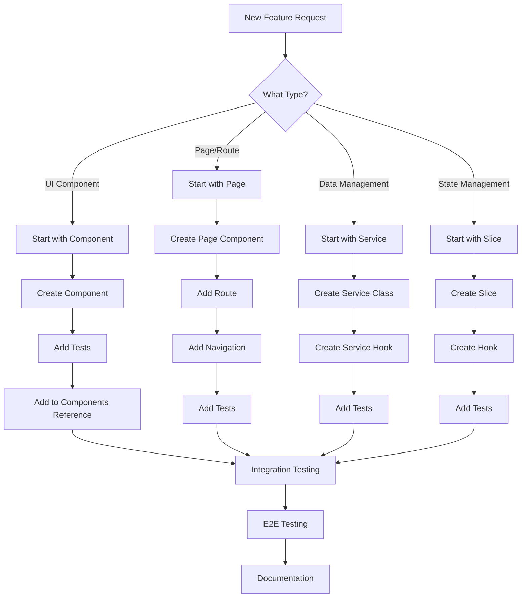

# Development Guide

## Overview

This template provides a modern React-based admin dashboard with advanced theming, user management, and role-based access control — ready to be extended for any project.

## Key Features

- **🌓 Advanced Theming**: Light/Dark mode with persistent storage
- **👥 User Management**: Complete CRUD operations with role-based permissions
- **🔐 Authentication**: Secure login with JWT token-based authentication
- **🔑 Password Setup**: Secure password initialization for new users
- **📱 Responsive Design**: Mobile-first approach with modern UI components
- **🧪 Comprehensive Testing**: Unit, integration, and E2E tests
- **⚡ Performance**: Optimized with lazy loading and code splitting
- **📚 Components Reference**: Interactive component showcase and documentation

## Quick Start

### Prerequisites

- **Node.js** (v24.0.0 or higher)
- **npm** (v10.0.0 or higher)

### Installation & Basic Commands

```bash
# Clone and install
git clone <repository-url>
cd Template
npm install

# Development
npm run dev              # Start dev server (http://localhost:3000)
npm run build            # Build for production
npm run preview          # Preview production build

# Testing
npm run test             # Run unit tests
npm run test:coverage    # Run with coverage
npm run cypress:open     # Open Cypress GUI
npm run cypress:run      # Run E2E tests headless
```

**Demo Credentials:** `admin@admin.com` / `admin123`

## Architecture Overview

### Project Structure

```
src/
├── components/          # App components (Layout, EntityToolbar, Guards, etc.); export from index.ts. UI primitives (Button, Card, GridPage) from solstice-ui
├── pages/              # Page components and routing
├── hooks/              # Custom React hooks
│   ├── queries/        # TanStack Query hooks (useUsersQuery, useRolesQuery, etc.)
│   ├── ui/             # UI-related hooks (useToast, useTheme, etc.)
│   └── auth/           # Authentication hooks
├── store/              # Redux store (client state only)
│   └── slices/        # Auth and theme slices
├── services/           # API service classes
│   ├── base/          # Base service classes (BaseService, normalizeApiResponse)
│   ├── auth/          # Authentication service
│   └── entities/      # Entity services (userService, roleService, etc.)
├── models/             # TypeScript type definitions and interfaces
│   └── generated.ts   # Auto-generated types from NSwag
├── utils/              # Utility functions
│   ├── entityOperations.ts  # CRUD helpers (handleEntitySave, handleEntityDelete)
│   ├── errorHandling.ts     # API error handling utilities
│   ├── routeUtils.ts        # Navigation and routing utilities
│   ├── permissionCache.ts   # Permission checking cache
│   ├── storage.ts           # Encrypted localStorage wrapper
│   └── ...                  # Other utilities (cn, env, logger)
├── config/             # Configuration files
│   ├── modules/        # Module configurations (users, roles, etc.)
│   ├── generated/      # Auto-generated constants (permissionKeys.generated.ts)
│   └── queryClient.ts  # TanStack Query client configuration
├── validations/        # Form validation schemas (Zod)
├── mock/               # Mock data and services
└── test/               # Test utilities and setup
```

### Architecture Principles

- **Component-Based**: Reusable, composable UI components
- **Separation of Concerns**: Clear boundaries between UI, business logic, and data
- **Type Safety**: Full TypeScript coverage
- **Testability**: Comprehensive testing at all levels
- **Scalability**: Modular architecture for easy expansion

## Development Workflow

### 🎯 Workflow Schema: What to Start With



### 📁 File Creation Order

#### 1. **New UI Component**

```
1. src/components/ComponentName/ComponentName.tsx
2. src/components/ComponentName/ComponentName.module.css (if needed)
3. src/components/ComponentName/ComponentName.test.tsx
4. Export from src/components/index.ts (add: export { default as ComponentName } from "./ComponentName/ComponentName";)
```
Use solstice-ui for primitives (Button, Card, Input, GridPage, etc.); add app-specific components here.

#### 2. **New Module (Full Feature)**

For complete features (like Reports, etc.), see **[Feature Development Workflow](./Feature-Development-Workflow.md)**.

```
1. Add permissions to PermissionKeys.cs   # Backend constants
2. Run ./scripts/regenerate-models.command (or `npm run regenerate-models`)  # Generate TS constants
3. src/config/modules/featureModule.ts    # Module configuration
4. Update src/config/modules/index.ts     # Export module
5. src/services/entities/featureService.ts # API service
6. src/hooks/queries/useFeatureQuery.ts   # TanStack Query hook
7. src/pages/feature/                     # Page components
8. Update src/config/navigation.ts        # Navigation
```

#### 3. **New Page**

```
1. src/pages/PageName.tsx
2. src/pages/PageName.test.tsx            # Co-located test
3. Add route in Container component
4. Add navigation link in navigation.ts
```

#### 4. **New Service**

```
1. src/services/entities/serviceName.ts
2. src/hooks/queries/useServiceNameQuery.ts  # TanStack Query hook
3. src/services/entities/serviceName.test.ts
4. src/hooks/queries/useServiceNameQuery.test.tsx
```

#### 5. **New Client-Only State (Redux)**

Use only for client state like auth or theme:

```
1. src/store/slices/featureSlice.ts       # Redux slice
2. Export from src/store/index.ts
3. src/store/slices/featureSlice.test.ts
```

#### 6. **New Type/Interface**

```
1. Modify backend DTOs                    # Source of truth
2. Run ./scripts/regenerate-models.command (or `npm run regenerate-models`)  # Generate TypeScript
3. Types available in src/models/generated.ts
```

## Module Configuration System

The application uses a centralized module configuration system to reduce duplication and maintain consistency across features.

### Module Structure

Each module is defined in `src/config/modules/` and contains:

```typescript
// src/config/modules/featureModule.ts
import { PERMISSION_KEYS } from "@/config/generated/permissionKeys.generated";

export const FEATURE_MODULE: ModuleConfig = {
  id: "feature",
  icon: FeatureIcon,
  
  // Route definitions
  routes: {
    base: "/feature",
    root: "/feature/*",
    detail: "/feature/:id",
    api: { /* API endpoints */ },
  },
  
  // Permission keys (use centralized constants!)
  permissions: {
    view: PERMISSION_KEYS.FEATURE.VIEW,
    create: PERMISSION_KEYS.FEATURE.CREATE,
    edit: PERMISSION_KEYS.FEATURE.EDIT,
    delete: PERMISSION_KEYS.FEATURE.DELETE,
  },
  
  // UI labels
  labels: {
    singular: "Feature",
    plural: "Features",
    menuLabel: "Feature Management",
    description: "Manage features",
    createButton: "Create Feature",
    backButton: "Back to Features",
  },
  
  // Test IDs for E2E testing
  testIds: {
    nav: "nav-feature",
    page: "feature-page",
    grid: "feature-grid",
    // ...
  },
  
  // Sidebar submenus
  submenus: [
    { id: "list", label: "Feature List", icon: List, path: "/feature", permission: "feature:view", testId: "nav-feature-list" },
  ],
  
  // In-page tabs (for list views)
  pageTabs: [
    { id: "all", label: "All", icon: List, path: "/feature", testId: "all-tab" },
    { id: "pending", label: "Pending", icon: Clock, path: "/feature/pending", permission: "feature:approve", testId: "pending-tab" },
  ],
  
  // Detail page tabs
  detailTabs: [
    { id: "details", label: "Details", testId: "details-tab" },
    { id: "config", label: "Configuration", permission: "feature:edit", testId: "config-tab" },
  ],
};
```

### Using Module Configuration

```typescript
import { FEATURE_MODULE, getModule, getModulePageTabs } from "@/config/modules";

// Access module properties
const { labels, permissions, routes } = FEATURE_MODULE;

// Get module by ID
const module = getModule("feature");

// Get tabs for a module
const tabs = getModulePageTabs("feature");
```

### TabNavigation Component

Use the reusable `TabNavigation` component for in-page navigation:

```typescript
import { TabNavigation } from "@/components";
import { FEATURE_MODULE } from "@/config/modules";

const MyPage = () => {
  const [activeTab, setActiveTab] = useState("all");
  const { hasPermission } = usePermissionCheck();

  const tabs = (FEATURE_MODULE.pageTabs ?? []).map(tab => ({
    id: tab.id,
    label: tab.label,
    icon: tab.icon,
    permission: tab.permission,
    testId: tab.testId,
  }));

  return (
    <TabNavigation
      tabs={tabs}
      activeTab={activeTab}
      onTabChange={setActiveTab}
      hasPermission={hasPermission}
    />
  );
};
```

## Centralized Constants (Single Source of Truth)

The application uses a centralized constants system to prevent hardcoded strings and ensure consistency between frontend and backend.

### Backend Constants (`PermissionKeys.cs`)

```csharp
// Template.Data/Constants/PermissionKeys.cs
public static class PermissionKeys
{
    public static class Users
    {
        public const string View = "users:view";
        public const string Create = "users:create";
        public const string Edit = "users:edit";
        public const string Delete = "users:delete";
    }
    // ... more categories
}

public static class RoleNames
{
    public const string Administrator = "administrator";
    public const string Support = "support";
    // ... more roles
}
```

### Frontend Constants (Auto-Generated)

Frontend constants are automatically generated from the C# source:

```bash
# Run from project root
./scripts/regenerate-models.command   # or: npm run regenerate-models
# Or manually: node generate-constants.js
```

This generates `src/config/generated/permissionKeys.generated.ts`:

```typescript
export const PERMISSION_KEYS = {
  USERS: {
    VIEW: "users:view",
    CREATE: "users:create",
    // ...
  },
  // ... more categories
} as const;

export const ROLE_NAMES = {
  ADMINISTRATOR: "administrator",
  SUPPORT: "support",
  // ...
} as const;
```

### Usage Examples

**Frontend:**
```typescript
import { PERMISSION_KEYS, ROLE_NAMES } from "@/config";

// Permission checking
const { hasPermission } = usePermissionCheck();
if (hasPermission(PERMISSION_KEYS.USERS.VIEW)) { ... }

// Role guards
<RoleGuard allowedRoles={[ROLE_NAMES.ADMINISTRATOR]}>
  <AdminContent />
</RoleGuard>
```

**Backend:**
```csharp
using static Template.Data.Constants.PermissionKeys;
using Template.Data.Constants;

[Authorize(Policy = Users.View)]
[HttpGet]
public async Task<IActionResult> GetUsers() { ... }

[Authorize(Roles = RoleNames.Administrator)]
[HttpGet("admin-only")]
public async Task<IActionResult> AdminEndpoint() { ... }
```

### Adding New Constants

1. **Add to `PermissionKeys.cs`** (backend)
2. **Run `./scripts/regenerate-models.command` or `npm run regenerate-models`** (generates TypeScript)
3. **Use the constants** in both frontend and backend

> ⚠️ **Never use hardcoded permission or role strings!** Always use the centralized constants.

## State Management Patterns

The application uses a **two-layer state management** approach:

### TanStack Query (Server State)

Use TanStack Query for all **server-side data** (API calls, CRUD operations):

```typescript
// hooks/queries/useUsersQuery.ts
import { useQuery, useMutation, useQueryClient } from "@tanstack/react-query";

export const useUsersQuery = () => {
  const queryClient = useQueryClient();
  
  // Fetch users with automatic caching and refetching
  const { data, isLoading, error } = useQuery({
    queryKey: ["users", filters],
    queryFn: () => userService.getUsers(filters),
  });

  // Mutations with automatic cache invalidation
  const addMutation = useMutation({
    mutationFn: userService.createUser,
    onSuccess: () => queryClient.invalidateQueries({ queryKey: ["users"] }),
  });

  return { users: data, isLoading, add: addMutation.mutateAsync };
};
```

**Benefits:**
- ✅ Automatic caching and background refetching
- ✅ Built-in loading/error states
- ✅ Automatic cache invalidation on mutations
- ✅ DevTools for debugging

### Redux Toolkit (Client State)

Use Redux **only** for **client-side state** (auth, theme, UI preferences):

```typescript
// Auth state (client-only)
const { user, isAuthenticated, login, logout } = useAuth();

// Theme state (client-only)
const { theme, toggleTheme } = useTheme();
```

**When to use Redux:**
- ✅ Authentication state
- ✅ UI preferences (theme, sidebar collapsed)
- ✅ State that doesn't come from the server

### Example: Full Feature Hook

```typescript
// Using TanStack Query for server state
const { users, isLoading, add, edit, remove } = useUsersQuery();
```

## Component Development

### Component Structure

Use plain function declarations (not `React.FC`) — this is the modern React convention:

```typescript
interface ComponentNameProps {
  title: string;
}

export default function ComponentName({ title }: ComponentNameProps) {
  return <div>{title}</div>;
}
```

### Testing Components

```typescript
import { render, screen } from "@testing-library/react";
import ComponentName from "../ComponentName";

describe("ComponentName", () => {
  it("renders correctly", () => {
    render(<ComponentName />);
    expect(screen.getByText("Expected Text")).toBeTruthy();
  });
});
```

## Mock Data System

The application includes a comprehensive mock data system for development and testing:

### Mock Services

- **Location**: `src/mock/services/`
- **Purpose**: Simulate API responses without backend
- **Usage**: Controlled by `VITE_USE_MOCK_DATA` environment variable

### Mock Data

- **Location**: `src/mock/data.ts`
- **Content**: Users, roles, permissions, dashboard data
- **Utilities**: `src/mock/utils.ts` for data manipulation

### Usage

```typescript
VITE_USE_MOCK_DATA = true;

const users = await userService.getUsers();
```

## API Integration

### Service Class Pattern

Services extend `BaseService` and use module configurations for API paths:

```typescript
import { BaseService } from "./base";
import { FEATURE_MODULE } from "@/config/modules";

class FeatureService extends BaseService {
  constructor() {
    super("feature"); // Base path: /api/feature
  }

  async getList(query: string) {
    // Uses module's API config: FEATURE_MODULE.routes.api.list(query)
    return this.request(`${FEATURE_MODULE.routes.api.list(query)}`);
  }

  async getById(id: string) {
    return this.request(`${FEATURE_MODULE.routes.api.byId!(id)}`);
  }
}
```

### Service Hook Pattern (TanStack Query)

All server data hooks use TanStack Query — no manual `useState`/`useCallback` loading patterns:

```typescript
export const useFeatureQuery = (params?: QueryParams) => {
  const queryClient = useQueryClient();

  const { data, isLoading, error, refetch } = useQuery({
    queryKey: ["features", params],
    queryFn: () => featureService.getList(buildQueryString(params)),
  });

  const addMutation = useMutation({
    mutationFn: featureService.create,
    onSuccess: () => queryClient.invalidateQueries({ queryKey: ["features"] }),
  });

  return {
    features: data?.items ?? [],
    paginationResult: data,
    isLoading,
    error,
    refetch,
    add: addMutation.mutateAsync,
  };
};
```

## Entity Operations

The application provides consolidated utilities for CRUD operations in `utils/entityOperations.ts`:

### handleEntitySave

For creating or updating entities:

```typescript
import { handleEntitySave } from "@/utils";

const result = await handleEntitySave(userData, {
  formMode: "create", // or "edit"
  addEntity: addUser,
  editEntity: ({ id, data }) => editUser({ id, data }),
  selectedEntity: selectedUser,
  entityName: `${userData.firstName} ${userData.lastName}`,
  successMessages: {
    created: USERS_MODULE.messages?.created || "User created",
    updated: USERS_MODULE.messages?.updated || "User updated",
  },
  showSuccess,
});
```

### handleEntityDelete

For deleting entities with confirmation:

```typescript
import { handleEntityDelete } from "@/utils";

await handleEntityDelete({
  entity: user,
  id: user.id,
  remove: deleteUser,
  entityName: "User",
  confirm: showConfirmation,
  showSuccess,
  showError,
  onDeleted: () => navigate("/users"),
});
```

### handleSubmitForm

For form submission with Zod schema validation:

```typescript
import { handleSubmitForm } from "@/utils";

await handleSubmitForm({
  data: formData,
  schema: userCreateSchema,
  onSave: async (data) => {
    const result = await addUser(data);
    return { success: result?.meta?.requestStatus === "fulfilled" };
  },
  entityName: "User",
  showSuccess,
  showError,
});
```

## Testing Strategy

### Test Types

1. **Unit Tests** - Individual components and functions
2. **Integration Tests** - Component interactions
3. **E2E Tests** - Complete user workflows

### Testing Commands

```bash
# Unit Testing
npm run test                    # Run unit tests
npm run test:watch             # Watch mode
npm run test:coverage          # With coverage

# E2E Testing
npm run cypress:open           # Interactive mode
npm run cypress:run            # Headless (sequential)
npm run cypress:run:parallel   # Headless (4 parallel processes, ~3-4x faster)

# With Coverage (from project root)
./scripts/generate-test-report.command   # Full pipeline; or: npm run coverage
```

## Components Reference

The application includes an interactive Components Reference page (`/components-reference`) that showcases all available UI components:

### Features

- **Live Examples**: Interactive component demonstrations
- **Code Snippets**: Copy-paste ready code examples
- **Props Documentation**: Complete prop interfaces and descriptions
- **Theme Testing**: Test components in light/dark themes
- **Responsive Testing**: Test components at different screen sizes

### Usage

```typescript
navigate("/components-reference");
```

## Performance Optimization

### Code Splitting

- Use `React.lazy()` for route-based splitting
- Implement component-level lazy loading
- Optimize bundle size with dynamic imports

### State Management

- Use TanStack Query for all server/API data
- Use Redux only for client state (auth, theme)
- Use local state for component-specific UI data
- Implement proper memoization with `useMemo` and `useCallback`

## Debugging

### Development Tools

- **React DevTools** - Component inspection
- **Redux DevTools** - State management debugging
- **Cypress Test Runner** - E2E test debugging
- **Browser DevTools** - Network and performance analysis

### Common Issues

1. **State not updating** - Check Redux actions and reducers
2. **API calls failing** - Verify service configuration and endpoints
3. **Tests failing** - Check test setup and mocks
4. **Build errors** - Verify TypeScript types and imports

## Deployment

### Build Process

```bash
npm run build          # Create production build
npm run preview        # Preview production build locally
```

### Environment Configuration

- Development: `npm run dev`
- Production: `npm run build`
- Testing: `npm run test`

## Best Practices

### Code Organization

- Keep components small and focused
- Use TypeScript for type safety
- Follow consistent naming conventions
- Implement proper error handling

### Performance

- Use React.memo for expensive components
- Implement proper loading states
- Optimize images and assets
- Use proper caching strategies

### Testing

- Write tests for all new features
- Maintain high test coverage
- Use meaningful test descriptions
- Test both happy and error paths

---

## Related Documentation

- **[Feature Development Workflow](./Feature-Development-Workflow.md)** - Complete guide for creating features from server to UI
- **[Testing Guide](./Testing-Guide.md)** - Testing strategies and examples
- **[Design Guide](./Design-Guide.md)** - UI/UX design principles
- **[Cypress Guide](./Cypress-Testing-Complete.md)** - E2E testing guide
- **[Security Enhancements](./Security-Enhancements.md)** - Auth and security features
