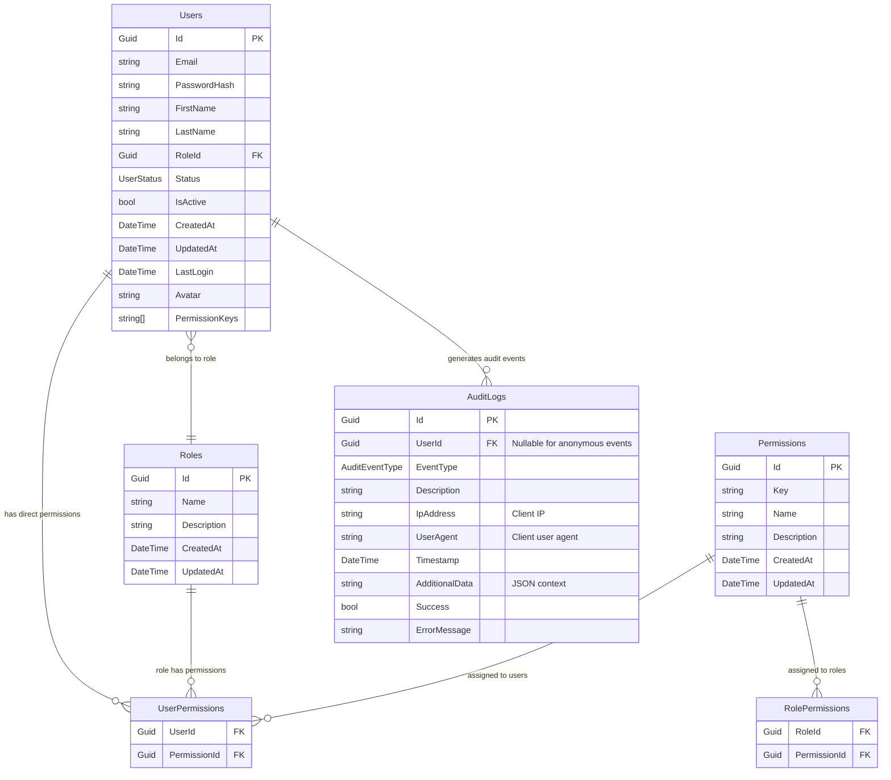

# 🗄️ Security Database Schema Diagram

## Database Tables for Security Features



## 🔍 Table Descriptions

### Core Authentication Tables
- **Users**: User accounts with authentication data
- **Roles**: User roles for role-based access control
- **Permissions**: Granular permissions for fine-grained access control

### Security Enhancement Tables
- **AuditLogs**: Comprehensive audit trail for all security events

### Junction Tables
- **UserPermissions**: Direct user-to-permission assignments
- **RolePermissions**: Role-to-permission assignments

## 🔑 Key Indexes for Performance

%% BlacklistedTokens table removed

### AuditLogs Table
```sql
-- Index on UserId for user-specific audit queries
CREATE INDEX IX_AuditLogs_UserId ON AuditLogs (UserId);

-- Index on EventType for filtering by event type
CREATE INDEX IX_AuditLogs_EventType ON AuditLogs (EventType);

-- Index on Timestamp for time-based queries
CREATE INDEX IX_AuditLogs_Timestamp ON AuditLogs (Timestamp);

-- Index on Success for filtering successful/failed events
CREATE INDEX IX_AuditLogs_Success ON AuditLogs (Success);
```

## 🔄 Data Flow Relationships

### Logout Flow (Simplified)
1. **User logs out** → Client discards JWT
2. **Every API request** → Standard JWT validation only

### Audit Logging Flow
1. **Authentication events** → Insert into AuditLogs
2. **Security monitoring** → Query AuditLogs by event type
3. **Forensic analysis** → Query by user, IP, or time range
4. **Compliance reporting** → Aggregate audit data

### Permission Checking Flow
1. **JWT contains permissions** → Check `perm` claims first
2. **Database fallback** → Query Users → Roles → Permissions
3. **Direct permissions** → Check UserPermissions table
4. **Role permissions** → Check RolePermissions table

## 📊 Security Metrics Queries

### Failed Login Attempts
```sql
SELECT IpAddress, COUNT(*) as FailedAttempts
FROM AuditLogs 
WHERE EventType = 'FailedLogin' 
  AND Success = false
  AND Timestamp >= NOW() - INTERVAL '1 hour'
GROUP BY IpAddress
ORDER BY FailedAttempts DESC;
```

### Token Refresh Patterns
```sql
SELECT UserId, COUNT(*) as RefreshCount
FROM AuditLogs 
WHERE EventType = 'TokenRefresh' 
  AND Success = true
  AND Timestamp >= NOW() - INTERVAL '24 hours'
GROUP BY UserId
ORDER BY RefreshCount DESC;
```

%% No active blacklisted tokens metrics (feature removed)

This database schema supports all the security features with optimized indexes for performance and comprehensive audit capabilities!
